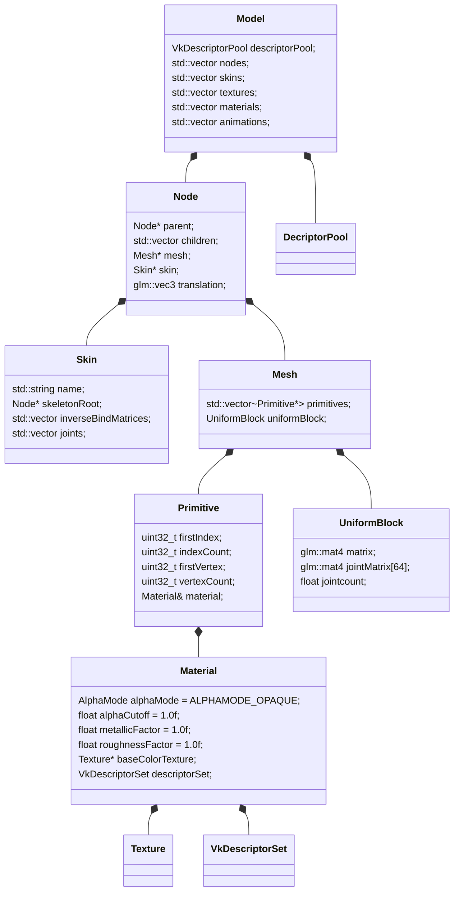

## URPWithVulkan Class

```mermaid
classDiagram

class Model{
	VkDescriptorPool descriptorPool;
	std::vector<Node*> nodes;
	std::vector<Skin*> skins;
	std::vector<Texture> textures;
	std::vector<Material> materials;
	std::vector<Animation> animations;
}

class Node{
	Node* parent;
	std::vector<Node*> children;
	Mesh* mesh;
	Skin* skin;
	glm::vec3 translation;
}

class Skin{
	std::string name;
	Node* skeletonRoot;
	std::vector<glm::mat4> inverseBindMatrices;
	std::vector<Node*> joints;
}

class Primitive{
    uint32_t firstIndex;
    uint32_t indexCount;
    uint32_t firstVertex;
    uint32_t vertexCount;
    Material& material;
}

class UniformBlock{
    glm::mat4 matrix;
    glm::mat4 jointMatrix[64];
    float jointcount;
}

class Mesh{
	std::vector~Primitive*> primitives;
	UniformBlock uniformBlock;
}

class Material{
    AlphaMode alphaMode = ALPHAMODE_OPAQUE;
    float alphaCutoff = 1.0f;
    float metallicFactor = 1.0f;
    float roughnessFactor = 1.0f;
	Texture* baseColorTexture;
	VkDescriptorSet descriptorSet;
}

Model *-- Node
Node *-- Mesh
Node *-- Skin
Mesh *-- Primitive
Mesh *-- UniformBlock
Material *-- Texture
Primitive *-- Material

Model *-- DecriptorPool
Material *-- VkDescriptorSet

```

