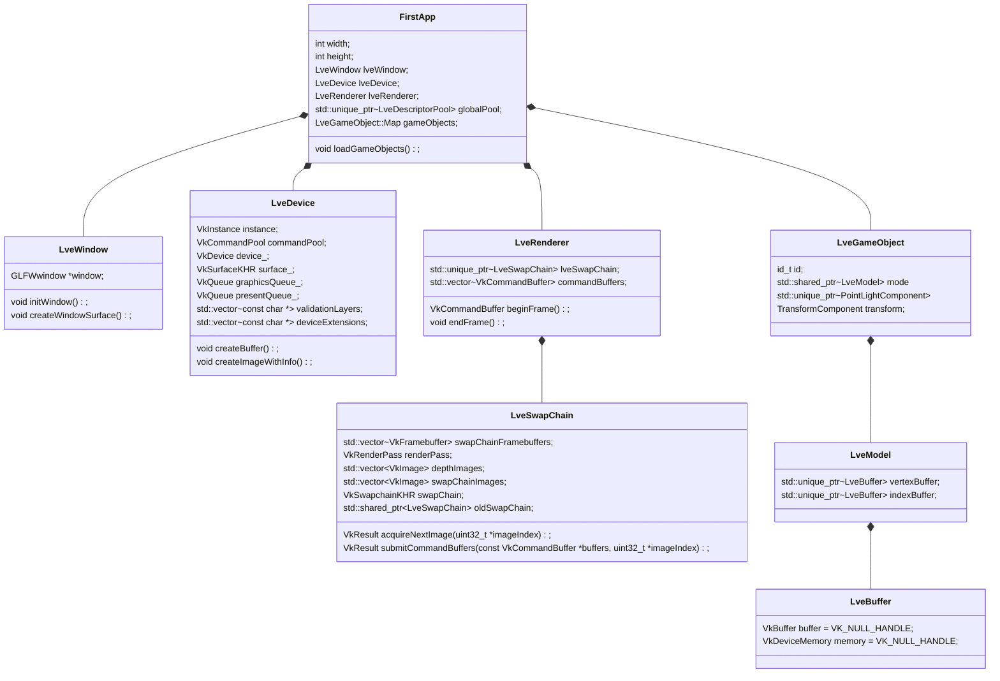
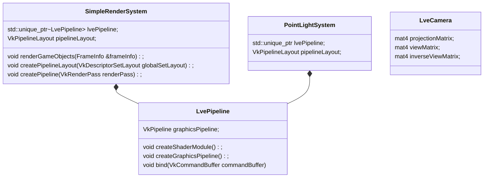
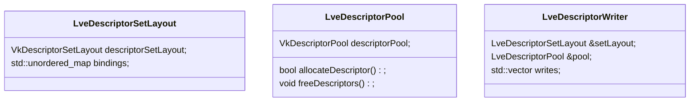

# littleVulkanEngine

```mermaid
classDiagram
class FirstApp{
	int width;
	int height;
	LveWindow lveWindow;
	LveDevice lveDevice;
	LveRenderer lveRenderer;
	std::unique_ptr~LveDescriptorPool> globalPool;
	LveGameObject::Map gameObjects;
	
	void loadGameObjects();
}

FirstApp *-- LveWindow
FirstApp *-- LveDevice
FirstApp *-- LveRenderer
FirstApp *-- LveGameObject

class LveWindow{
	GLFWwindow *window;
	
	void initWindow();
	void createWindowSurface();
}

class LveDevice{
    VkInstance instance;
    VkCommandPool commandPool;
    VkDevice device_;
    VkSurfaceKHR surface_;
    VkQueue graphicsQueue_;
    VkQueue presentQueue_;	
    std::vector~const char *> validationLayers;
    std::vector~const char *> deviceExtensions;
    
    void createBuffer();
    void createImageWithInfo();
}

class LveRenderer{
	std::unique_ptr~LveSwapChain> lveSwapChain;
	std::vector~VkCommandBuffer> commandBuffers;
	
	VkCommandBuffer beginFrame();
	void endFrame();
}

LveRenderer *-- LveSwapChain

class LveSwapChain{
	std::vector~VkFramebuffer> swapChainFramebuffers;
	VkRenderPass renderPass;
	std::vector~VkImage~ depthImages;
	std::vector~VkImage~ swapChainImages;
	
	VkSwapchainKHR swapChain;
	std::shared_ptr~LveSwapChain~ oldSwapChain;
	VkResult acquireNextImage(uint32_t *imageIndex);
	VkResult submitCommandBuffers(const VkCommandBuffer *buffers, uint32_t *imageIndex);
}

class LveGameObject{
	id_t id;
	std::shared_ptr~LveModel> mode
	std::unique_ptr~PointLightComponent> 
	TransformComponent transform;
}

LveGameObject *-- LveModel

class LveModel{
	std::unique_ptr~LveBuffer> vertexBuffer;
	std::unique_ptr~LveBuffer> indexBuffer;
}
LveModel *-- LveBuffer
class LveBuffer{
    VkBuffer buffer = VK_NULL_HANDLE;
    VkDeviceMemory memory = VK_NULL_HANDLE;
}
```

```mermaid
classDiagram

class SimpleRenderSystem{
    std::unique_ptr~LvePipeline> lvePipeline;
    VkPipelineLayout pipelineLayout;

	void renderGameObjects(FrameInfo &frameInfo);
	void createPipelineLayout(VkDescriptorSetLayout globalSetLayout);
	void createPipeline(VkRenderPass renderPass);
}

SimpleRenderSystem *-- LvePipeline

class PointLightSystem{
    std::unique_ptr<LvePipeline> lvePipeline;
    VkPipelineLayout pipelineLayout;	
}

PointLightSystem *-- LvePipeline

class LvePipeline{
	VkPipeline graphicsPipeline;
	void createShaderModule();
	void createGraphicsPipeline();
	void bind(VkCommandBuffer commandBuffer)
}

class LveCamera{
      mat4 projectionMatrix;
      mat4 viewMatrix;
      mat4 inverseViewMatrix;
}

```

```mermaid
classDiagram
class LveDescriptorSetLayout{
  VkDescriptorSetLayout descriptorSetLayout;
  std::unordered_map bindings;	
}

class LveDescriptorPool{
	VkDescriptorPool descriptorPool;
	bool allocateDescriptor();
	void freeDescriptors(); 
}

class LveDescriptorWriter{
  LveDescriptorSetLayout &setLayout;
  LveDescriptorPool &pool;
  std::vector<VkWriteDescriptorSet> writes;
}

```

